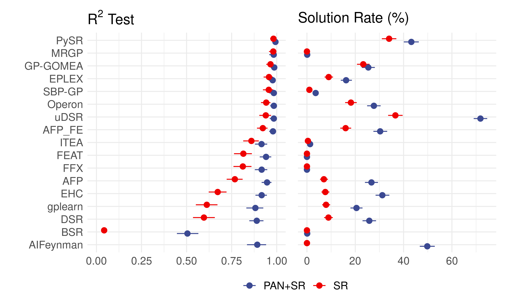

# PAN+SR: Ab initio nonparametric variable selection for scalable Symbolic Regression

Symbolic regression (SR) is a powerful technique for discovering symbolic expressions that characterize nonlinear relationships in data. However, existing SR methods do not scale to datasets with a large number of input variables, which are common in modern scientific applications.

Inspired by the idea of Parametic-Assisted by Nonparametric (PAN) introduced in [Ye et al.](https://www.tandfonline.com/doi/abs/10.1080/01621459.2023.2294527), we propose a method called **PAN+SR**, which combines a key idea of ab initio nonparametric variable selelction with SR to efficiently pre-screen large input spaces and reduce search omplexity while maintaining accuracy. The pre-screening nature of **PAN+SR** makes it versatile and can be used with **any** exsiting SR methods.

**PAN+SR** builds on an existing SR benchmarking platform, [SRBench](https://github.com/cavalab/srbench/tree/master), to enable

- PAN+SR pre-screening for any dataset and SR method
- Benchmarking SR methods on the extened Feynman Symbolic Regression Database, which include
    - observation error (tunable signal-to-noise ratio)
    - irrelevant features

On the extended Feynman datasets, PAN+SR consistently improves the standalone SR methods in both symbolic solution rate and predictive accuracy.
<p align="center">

</p>

# Using PAN+SR

## Installation

We provide a [base conda environment](base_environment.yml) for PAN+SR, which does not include any SR methods. To install SR methods benchmarked in the paper, please see [README](extra_environment/README.md) in the [extra_environment](extra_environment/) folder.

**Note:** PAN+SR relies on the R package [bartMchine](https://cran.r-project.org/web/packages/bartMachine/index.html) for its BART implementation; it is required to run PAN+SR.

1. Install the conda environment:

```bash
conda env create -f base_environment.yml
conda activate pansr
```

2. Download the PMLB datasets:

```bash
git clone https://github.com/EpistasisLab/pmlb/ [/path/to/pmlb/]
cd /path/to/pmlb
sudo apt-get install git-lfs
git lfs pull
```

3. Install bartMachine in R:

```R
install.packages("bartMachine")
```

## Generating the extended Feynman Symbolic Regression Database

We extended the [Feynman Symbolic Regression Database](https://space.mit.edu/home/tegmark/aifeynman.html) to include irrelevant features, i.e., features not used in the Feynman equations. Adding these irrelevant features resembles more realistic scientific applications, where features associated with the data-generating function $f_0(x)$ are unknown apriori.

The extended Feynman dataset can be generated using `generate_feynman_dataset.py` in the `feynman_dataset_code/` folder. An example usage is:

```bash
python generate_feynman_dataset.py \
    -results /path/to/feynman \ # Directory to store the dataset
    -n 100000 \ # number of samples for each dataset
    -signal_ratio 50  # number of irrelevant features per true feature
```


## Reproducing the benchmark results

All experiments are launched from the `experiments/` folder via the script `analyze.py`. The script can be configured to run the experiment in parallel locally, on an LSF job scheduler, or on a SLURM job scheduler. To see the full set of options, run `python analyze.py -h`.

Example bash scripts are provided in `experiments/` folder with filename `submit_*.sh`.

**WARNING**: running some of the commands below will submit tens of thousands of experiments. 
Use accordingly. 

### Black-box experiment
To run pre-screening only on the PMLB datasets 

```bash
vs_method=BART_VIP
rep=20
python analyze.py /path/to/pmlb \
    -script BART_selection \
    -ml ${vs_method} \
    -results ../results_blackbox/${vs_method}/ \
    -n_trials 10 \
    -n_jobs 1 \
    -rep $rep \
    -time_limit 24:00 \
```

To run standalone SR methods (only Operon in this case) on the PMLB datasets

```bash
for ml in "tuned.OperonRegressor"; do
    python analyze.py /path/to/pmlb \ 
        -ml ${ml} \
        -results ../results_blackbox/SR/ \
        -n_trials 10 \
        -n_jobs 1 \
        -time_limit 24:00 \
        -tuned -skip_tuning \
done
```

To run PAN+SR on the PMLB datasets

```bash
vs_method=BART_VIP
rep=20
for ml in "tuned.OperonRegressor"; do
    python analyze.py /path/to/pmlb \ 
        -ml ${ml} \
        -results ../results_blackbox/SR_${vs_method}/ \
        -n_trials 10 \
        -n_jobs 1 \
        -time_limit 24:00 \
        -vs_method ${vs_method} \
        -vs_result_path ../results_blackbox/pmlb_${vs_method}_withidx.feather \
        -vs_idx_label idx_hclst \
        -rep ${rep} \
        -tuned -skip_tuning \
done
```

### Ground-truth experiment

To run the above scripts on the extended Feynman datasets, change

- `/path/to/pmlb` to `/path/to/feynman`
- `-results ../results_blackbox` to `-results ../results_feynman`
- `-vs_result_path ../results_blackbox/pmlb_${vs_method}_withidx.feather` to `-vs_result_path ../results_feynman/feynman_${vs_method}_withidx.feather`
- Add `-sym_data`

Below is the script for running PAN+SR on various sample size `n` and signal-to-noise ratio `snr`

```bash
vs_method=BART_VIP
for ml in "tuned.OperonRegressor"; do
    for n in 500 1000 1500 2000; do # sample size n
        for snr in 0 20 15 10 5 2 1 0.5; do # signal-to-noise ratio
            echo "Running ${ml}+${vs_method} on Feynman datasets with n = ${n}, SNR = ${snr},..."
            nohup python analyze.py /path/to/feynman \ 
                -ml ${ml} \ # SR method to train
                -results ../results_feynman/SR_${vs_method}/n_${n}/ \ # result directory
                -signal_to_noise $snr \ # signal-to-noise ratio
                -n $n \ # sample size n
                -sym_data \ # ground-truth datasets
                -n_trials 10 \ # number of trials per dataset
                -n_jobs 1 \ # number of jobs in parallel
                -time_limit 24:00 \ # time limit in hours
                -job_limit 1000 \ # number of jobs actually getting submitted
                -vs_method ${vs_method} \ # variable selection method
                -vs_result_path ../results_feynman/feynman_${vs_method}_withidx.feather \ # pre-run variable selection result
                -vs_idx_label idx_hclst \ # label of the variable selection result
                -rep 20 \  # number of BART replicates to run
                -tuned -skip_tuning \ # use the tuned parameters in SRBench
                >"logs/feynman_${ml}_${vs_method}_n${n}_snr${snr}.out" \
                2>"logs/feynman_${ml}_${vs_method}_n${n}_snr${snr}.err" &

            # Wait for the background job to finish
            wait $!

            # Check the exit status of the nohup command
            if [ $? -gt 0 ]; then
                echo "Job with ${ml}+${vs_method}, n = ${n}, SNR = ${snr} failed, exiting loop."
                break
            fi

            echo "Finished ${ml}+${vs_method}, n = ${n}, SNR = ${snr}..."
        done
    done
done
```
If `-vs_result_path` is not given, pre-screening will be run in-place.

**Symbolic Assessment**: Following model training, the trained models are assessed for symbolic equivalence with the ground-truth data-generating processes. 
This is handled in [assess_symbolic_model.py](experiment/assess_symbolic_model.py). There are 5 steps in this process:

1. Clean up the trained model for SymPy parsing
2. Simplify the cleaned model with SymPy
3. Check whether the symbolic difference between the simplified model and the true model is a constant
4. Check whether the symbolic ratio between the simplified model and the true model is a constant
5. Calculate the model size of the simplified model

Use `analyze_symbolic_model.py` to generate batch calls to this function as follows:

```bash
# assess the ground-truth models that were produced using sympy
time_limit=300
dataset=feynman
vs_method=BART_VIP

for step in 1 2 3 4 5; do
    echo "Running Sympy Step ${step} on ${dataset}_SR_${vs_method}..."
    nohup python analyze_symbolic_model.py ../results_${dataset}/SR_${vs_method}/ \
        -results ../results_${dataset}/SR_${vs_method}/ \
        -data_path /path/to/feynman \
        -n_jobs 1 \
        -timeout ${time_limit} \ # time limit in seconds
        -step ${step} \
        >"logs/sympy_step${step}_${dataset}_SR_${vs_method}.out" \
        2>"logs/sympy_step${step}_${dataset}_SR_${vs_method}.err" &

    # Wait for the background job to finish
    wait $!

    # Check the exit status of the nohup command
    if [ $? -gt 0 ]; then
        echo "Sympy Step ${step} on ${dataset}_SR_${vs_method} failed... exiting loop."
        break
    fi

    echo "Finished Sympy Step ${step} on ${dataset}_SR_${vs_method}..."
done
```

**Output**: existing `.json` file in `../results_${dataset}/SR_${vs_method}/` will be modified.

### Post-processing

The [postprocessing](postprocessing) folder contains two Jupyter notebooks, [collect_results_feynman.ipynb](postprocessing/collect_results_feynman.ipynb) and [collect_results_pmlb.ipynb](postprocessing/collect_results_pmlb.ipynb), for consolidating `.json` files to `.feather` file. They also perform some cleanup like shortening algorithm names, etc.

These `.feather` files are used in the [postprocessing/figs/](postprocessing/figs/) folder to generate figures for the paper, and are available in the [results_blackbox](results_blackbox) and [results_feyman](results_feynman) folders. Below is a summary of these `.feather` files

- [pmlb_BART_VIP_withidx.feather](results_blackbox/pmlb_BART_VIP_withidx.feather): Selected features for PMLB datasets using BART average variable inclusion proportion rankings
- [pmlb_results.feather](results_blackbox/pmlb_results.feather): Standalone SR and PAN+SR results on PMLB datasets
- [feynman_BART_VIP_withidx.feather](results_feynman/feynman_BART_VIP_withidx.feather): Selected features for Feynman datasets using BART average variable inclusion proportion rankings
- [feynman_results.feather](results_feynman/feynman_results.feather) Standalone SR and PAN+SR results on Feynman datasets

# References

A pre-print of the current version is available:

Ye, S. and Li, M. (2024). 
Ab initio nonparametric variable selection for scalable Symbolic Regression with large $p$. 
[arXiv](https://arxiv.org)


# Contact

Shengbin Ye (@mattsheng), sy53 dot rice dot edu
